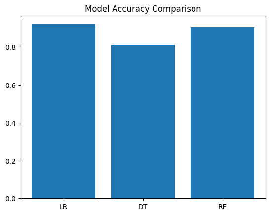
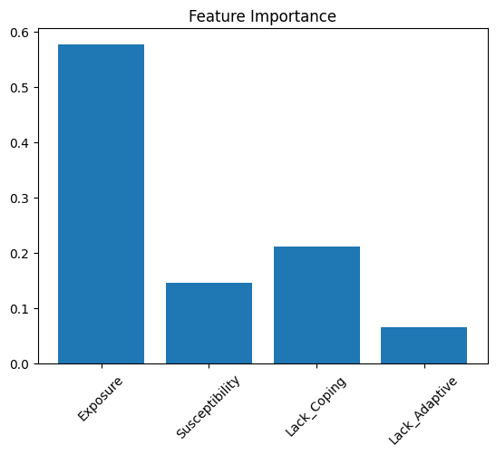

# Disaster Risk Prediction using PySpark

## Overview

This project develops a scalable machine learning pipeline using PySpark to classify disaster risk levels based on the World Risk Index (WRI) dataset. The study focuses on understanding how exposure and vulnerability-related indicators contribute to disaster risk classification.

## Problem Statement

To classify disaster risk levels (WRI Category) using key indicators related to hazard exposure and societal vulnerability.

## Dataset

* World Risk Index dataset (multi-country, multi-year)
* Indicators used:

  * Exposure
  * Susceptibility
  * Lack of Coping Capacity
  * Lack of Adaptive Capacity

## Conceptual Framework

The World Risk Index is based on the relationship:

* Risk = Exposure + Vulnerability
* Vulnerability = Susceptibility + Lack of Coping Capacity + Lack of Adaptive Capacity

This implies that the target variable (WRI Category) is derived from the same underlying indicators used as model inputs.

## Methodology

### Data Preprocessing

* Cleaned and standardized column names
* Selected relevant indicators
* Removed missing values

### Feature Engineering

* Assembled features using VectorAssembler
* Encoded target variable using StringIndexer

### Model Design Choice

Vulnerability was excluded from the model to avoid redundancy, as it is derived from its sub-components. This ensures better interpretability and avoids multicollinearity.

### Models Implemented

* Logistic Regression
* Decision Tree
* Random Forest

## Results

| Model               | Accuracy  | F1 Score  |
| ------------------- | --------- | --------- |
| Logistic Regression | **0.920** | **0.920** |
| Decision Tree       | 0.811     | 0.806     |
| Random Forest       | 0.905     | 0.905     |

## Visualizations

### Model Comparison

### Feature Importance

## Key Insights

* Logistic Regression performed best, indicating strong linear separability in the data
* Exposure is the dominant factor influencing disaster risk
* Lack of coping capacity is the most important socio-economic modifier
* Results are consistent with the theoretical disaster risk framework

## Feature Importance (Random Forest)

* Exposure: 0.577
* Lack of Coping Capacity: 0.212
* Susceptibility: 0.146
* Lack of Adaptive Capacity: 0.065

## Interpretation

Since the target variable is derived from the same underlying indicators, the model performance reflects the internal consistency of the World Risk Index rather than an independent predictive task.

This project can be understood as:

* Reconstruction of a global risk classification system
* Empirical validation of the disaster risk framework
* Application of machine learning to structured risk indices

## Application

This approach can support:

* Preliminary disaster risk screening
* Risk classification for planning and policy
* Validation of composite risk indices

## Limitations

* Target variable is derived from input features (conceptual dependency)
* High accuracy reflects structural consistency rather than independent prediction
* Dataset consists of aggregated indices, not raw variables

## Future Work

* Predict future risk (temporal modelling)
* Integrate climate variables (rainfall, cyclones)
* Combine socio-economic and hazard datasets for independent prediction

## Tools Used

* PySpark
* Spark MLlib
* Python

## Data Source

Dataset obtained from Kaggle notebook input:
https://www.kaggle.com/code/vibhuti25/world-risk-analysis/input

The data is based on the World Risk Index, which evaluates disaster risk using exposure and vulnerability-related indicators across countries.

## Author

Ashwin Jayakumar
